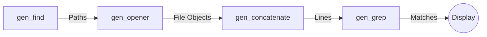
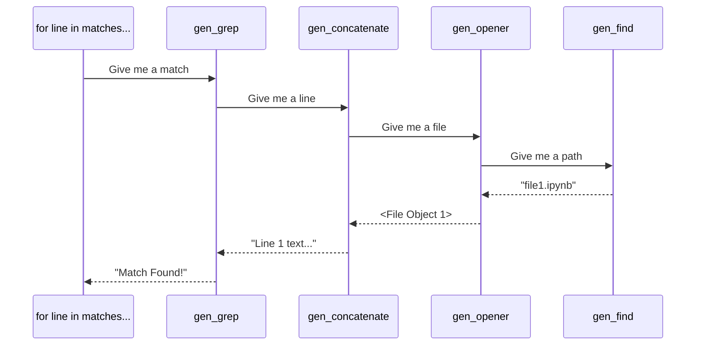

# Understanding the Generator Pipeline

This document explains the technical implementation, control flow, and data architecture of the Python generator pipeline used for memory-efficient file processing.

---

## 1. The Core Concept: "Piped Data"

In a traditional approach, you might read all files into a list, then process that list. With **Generators**, we create a "pipeline" where data flows one item at a time.

### The Pipeline Architecture



---

## 2. Component Breakdown

### I. `gen_find(filepat, top)`

- **Purpose**: Recursively scans folders to find files matching a pattern (e.g., `*.ipynb`).
- **Mechanism**: Uses `os.walk` to crawl the disk.
- **Output**: A stream of string paths.

### II. `gen_opener(filenames)`

- **Purpose**: Converts paths into actual open file objects.
- **The "Magic"**:
  ```python
  yield f
  f.close()
  ```
  When the next component asks for a new file, the generator resumes, executes `f.close()`, and only _then_ opens the next file. This guarantees **that only one file is open at any given moment**.

### III. `gen_concatenate(iterators)`

- **Purpose**: Flattens the structure.
- **Mechanism**: It takes a sequence of "open files" (which are iteratable) and uses `yield from` to pull every line out of them.
- **Output**: A single, continuous stream of text lines.

### IV. `gen_grep(pattern, lines)`

- **Purpose**: The filter.
- **Mechanism**: It checks each line against a Regular Expression.
- **Output**: Only lines that match the search term.

---

## 3. The Control Flow: The "Pull" Mechanism

A common mistake is thinking the code starts at the top and "pushes" data down. It is actually the opposite. **The data is PULLED from the bottom.**

### The Execution Sequence:

1.  **The Final Loop**: When you call `for line in matches:`, you are asking the pipeline for an item.
2.  **Back-Pressure**: `gen_grep` says "I need a line to check," so it asks `gen_concatenate`.
3.  **The Chain Reaction**:
    - `gen_concatenate` asks `gen_opener` for a file.
    - `gen_opener` asks `gen_find` for a path.
    - `gen_find` hits the disk, finds a file, and sends the path forward.
4.  **Completion**: Once a match is found, it travels all the way to the `print()` statement.

### Control Flow Diagram



---

## 4. Why Use This?

1.  **Memory (RAM)**: If you search 100GB of logs, your RAM usage stays at ~5MB because only **one line** and **one file** exist in memory at an instant.
2.  **Laziness**: If you only need the first 10 matches, the pipeline stops immediately. It never even looks at the remaining 500 files on your disk.
3.  **Cleanup**: Files are automatically closed as the pipeline "pulls" past them.
